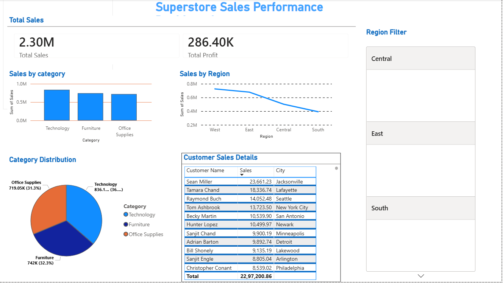

# 📊 Superstore Sales Performance Dashboard (Power BI)

🚀 Built using Power BI to analyze retail sales data

## 📊 Project Overview
This project is a Power BI dashboard built using Superstore dataset to analyze sales performance.

## 🔍 Key Insights

* Total Sales and Profit overview
- 📈 Technology category has highest sales
- 🌍 West region contributes maximum revenue
- 📉 South region shows lowest performance
* Sales by Region
* Customer Sales Details

## 🛠 Tools Used
* Power BI
* CSV Dataset

## 📷 Dashboard Preview
  

## ▶️ How to Use

1. Download the `.pbix` file  
2. Open in Power BI Desktop  
3. Explore visuals and filters  

## 📁 Files
- 📁 Superstore_Sales_Dashboard.pbix (Power BI file) 
## 📌 Conclusion

This dashboard helps understand sales trends and supports decision-making.

## 📌 Author

Teju K  
Aspiring Data Analyst  
